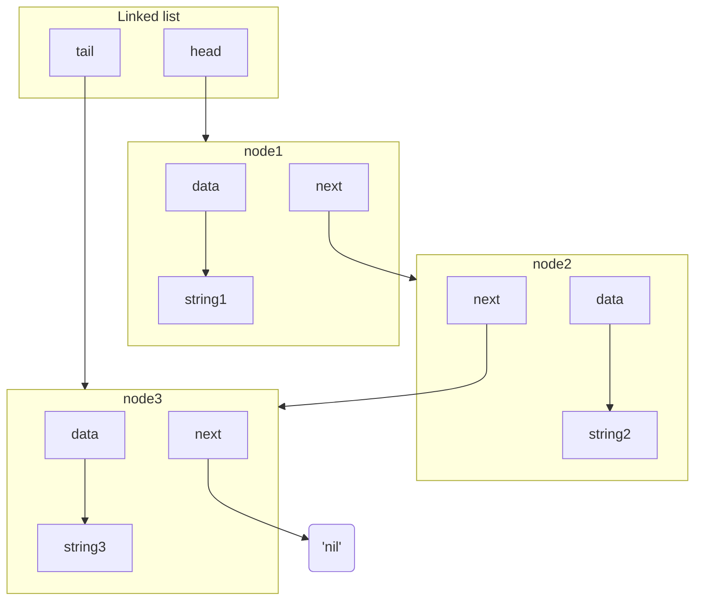

# Exploring linked list

```mermaid
flowchart
 subgraph s1["Linked list"]
        n1["head"]
        n2["tail"]
 end
 subgraph s2[node1]
   s2data["data"] --> s2s["string1"]
   s2next["next"]
 end
 s2next --> s3

 subgraph s3[node2]
   s3data["data"] --> s3s["string2"]
   s3next["next"]
 end
 s3next --> s4
  subgraph s4[node3]
   s4data["data"] --> s4s["string3"]
   s4next["next"]
 end
 n1 --> s2 
 n2 --> s4
 s4next --> *('nil')
```

## Task 1: Removing a node from a linked list

Write a method that removes first node from a linked list.

